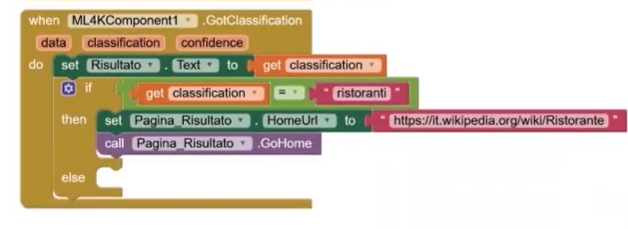

# Relazione di progetto

## 1. Introduzione e brainstorming
Descrivi l'idea dell'app, gli obiettivi e il target.

  
*Figura 1 – Schermata principale dell’app con pulsanti di navigazione.*

## 2. Progettazione
- Schermate principali (con immagini in `/screenshots/`)
- Blocchi utilizzati e logica di funzionamento
- Scelte grafiche e layout

## 3. Componenti obbligatori
- Pulsanti, Label, TextBox
- Condizioni if-then-else
- Liste
- WebViewer
- Spreadsheet e grafici
- Vertical e Horizontal Arrangement

## 4. Parte multidisciplinare
Spiega i collegamenti con le discipline studiate.

## 5. Versionamento e ruoli
Inserisci la tabella delle versioni (vedi `CHANGELOG.md`).

## 6. Conclusioni
Riflessione finale e contributi individuali.
